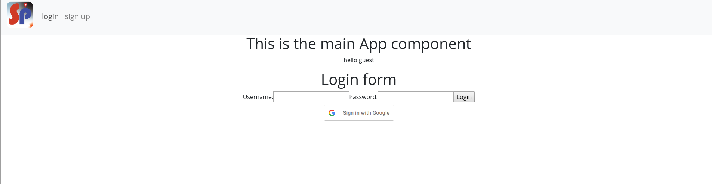

# User Story 1
User can register/login the account with the google account (or email) and password
  a. oauth
  b. After registration or login the app will direct user to main screen
  c. Every page redirects to this page if not logged in

A fresh visit to the web app should ask users to register through Oauth to enter the website. If the user has already registered, signing in through Oauth should prompt users to be redirected to the main content screen. If the user tries to access the web app without being logged in, they should be redirected to this splash screen / login screen.

The sign up form page looks like this:

If the user chooses to sign in with a Google account, the page looks like this:

After logged in, the app will lead the user to a welcome page (Home Page):

