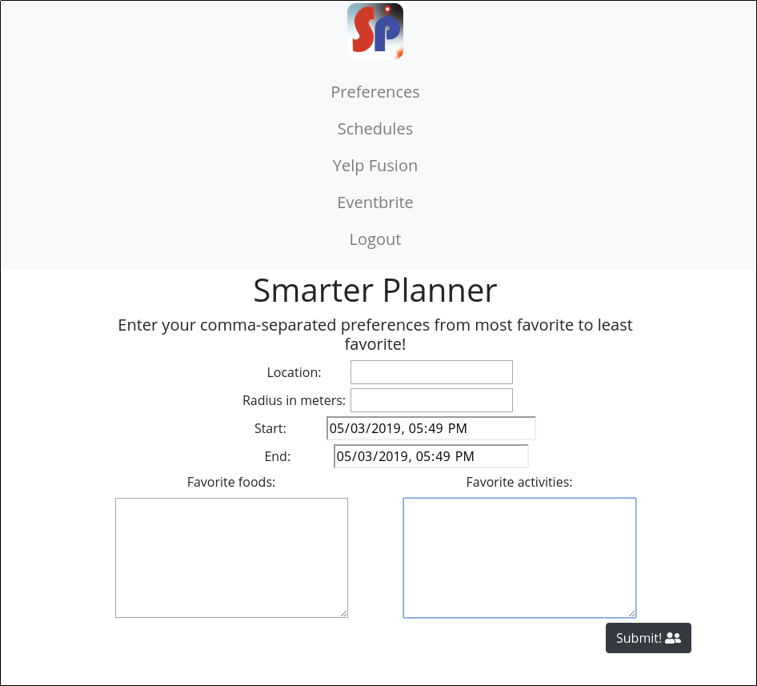
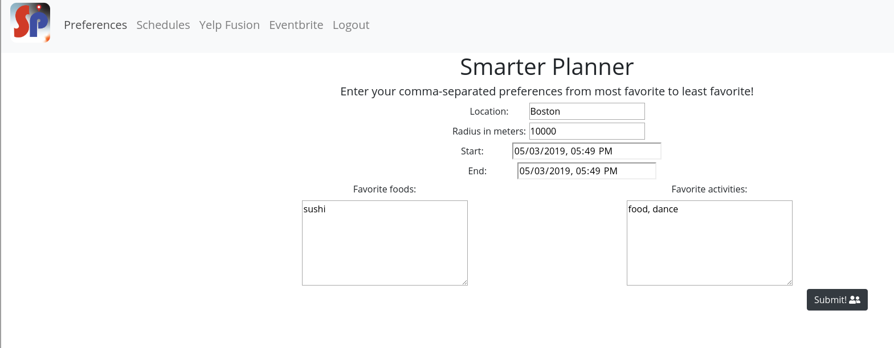

# User Story 2
In the application, user can set, edit and rank preferences by inputting the location, activities, types of restaurants(preferred food type), and duration (time frame).
  a. Enter user’s preferred location, estimated radius in meters to set a certain area for the app to search from
  b. Enter the Start Time and End Time to control your own time frame. If not enter anything, the system will set the default time as current time.
  c. Enter comma-separated preference of foods from most favorite to least favorite
  d. Enter the user’s favorite activities
  e. Rearrange and edit the preferences by editing the “Preferences” screen
  f. After editing the personal preference, tap the “Submit!” button below in the “Preference” screen

If the user hasn’t already done so, once logged in, the web app should prompt users to input and set their “Preferences” pertaining to trip location, types of activities, food type, and the trip duration. Their preferences will be sorted on a list of top 10 choices at the “Schedules” screen, connecting to both Yelp API and Eventbrite API. If want to add more preferences, user can go back to “Preferences” and add more by comma, and click the “Submit” button again.

The page of “Preferences” will initially look like this: 

The user may input the data in this format:

