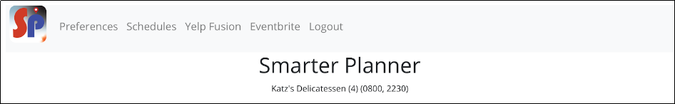

# User Story 3

User can see the suggested agenda in “Schedules” tab made based on the user’s preference previously
  a. The top 10 matched outcomes will show up in the “Schedules” screen, followed by the rating of each place and opening time available 
  b. User can save their favorite suggested agenda(s) for future use

Users, once they have specified their preferences, can then generate a suggested agenda based on the preferences they inputted earlier in the new “Schedules” page. They can get informations of the suggested agenda with suggested the rating of each place and opening time available to better suit their schedule. For example, we get Katz’s Delicatessen as the top 1 suggested agenda based on preference. The rating score of this restaurant is to be a 4 out of 5, and it's open from 08:00 to 22:30 for a usual Monday.

Here's an example of a possible schedule:

